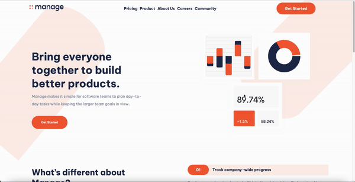
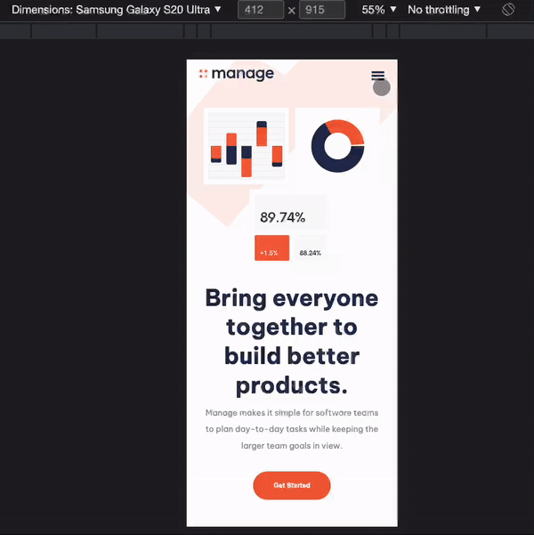

# Project Manage Landing Page Master
## Mobile, tablet and desktop versions.

* create a landing page without tutorial, only search on internet document and stack Overflow.

## Project
* Live Manage landing page [link](https://pittyh6.github.io/manage-landing-page-master/index.html)
* Manage landing page [link](https://github.com/pittyh6/manage-landing-page-master)

## Management Tools
* Jira(Sprints) [link](https://github.com/pittyh6/manage-landing-page-master/tree/master/Sprint2)
### Result
* Desktop

* Mobile/tablet

## Tools

## What I learned/used
* HTML
* HTML5
* CSS
* Flexbox
* Grid 
* git / gitHub
* jira
* JQuery
* Background shapes
* Responsive
* Order: mobile, tablet, desktop.
* Hamburguer menu (javaScript)
* SlideShow/carousel (javaScript)

